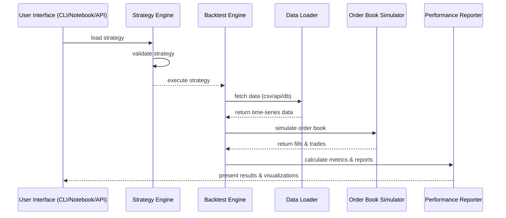
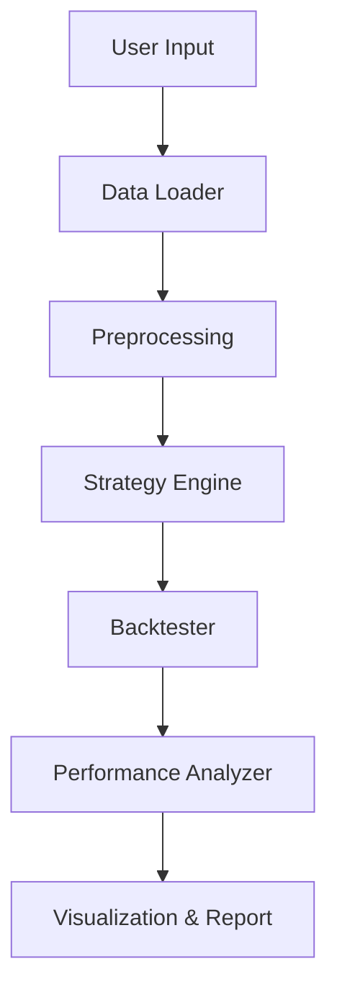

# ZVT-MASTER


> **ZVT-MASTER** is a modular Python-based backtesting framework for analyzing trading strategies on time-series financial data.

---

## 📚 Table of Contents

- [✨ Features](#-features)  
- [🧱 Architecture](#-architecture)  
- [🔁 Flowchart](#-flowchart)  
- [🛠 Installation](#-installation)  
- [🚀 Usage](#-usage)  
- [🧪 Testing](#-testing)  
- [📊 Screenshots](#-screenshots)  
- [📂 File Structure](#-file-structure)  
- [📦 Modules Overview](#-modules-overview)  
- [🧩 Sample Strategies](#-sample-strategies)  
- [🤝 Contributing](#-contributing)  
- [🪪 License](#-license)  
- [📬 Contact](#-contact)  

---

## ✨ Features

- 📈 Strategy plug-and-play framework  
- 🧠 Support for technical indicators & machine learning  
- 🕒 Custom date filtering, trading window support  
- ⚙️ Multi-asset and multi-timeframe support  
- 📦 Compatible with CSV, SQL, APIs  
- 📊 Generates detailed metrics and visualizations  
- 📚 Fully testable with PyTest and coverage tools  

---

## 🧱 Architecture


### Flowchart



### Installation

# Clone the repository
```bash
git clone https://github.com/yourusername/ZVT-MASTER.git
cd ZVT-MASTER
```
# Create a virtual environment
```bash
python -m venv venv
source venv/bin/activate  # On Windows: venv\Scripts\activate
```

# Install dependencies
```bash
pip install -r requirements.txt
pip install .
```

### Usage
Basic Python Usage
python
Copy
Edit

```python
from zvt_master import BacktestEngine

engine = BacktestEngine(
    data_source="data/BTC_USD.csv",
    strategy="examples/moving_average.py",
    initial_capital=100000
)
results = engine.run()
engine.plot(results)
```
### Cli Use
```bash
python run_once.py --data data/SPY.csv --strategy examples/macrossover.py
```

### File Structure
```bash
ZVT-MASTER/
├── .github/workflows/       → CI/CD configs
├── api-tests/               → API validation tests
├── docs/                    → Documentation and diagrams
├── examples/                → Strategy examples
├── requirements/            → Optional dependency groups
├── sql/                     → Database schema/scripts
├── src/                     → Core application source
│   ├── engine/              → Backtesting logic
│   ├── strategy/            → Strategy templates
│   └── metrics/             → Reports and metrics
├── tests/                   → Unit/integration tests
├── .coveragerc              → Coverage config
├── build.sh                 → Build script
├── code_of_conduct.md       → Contributor guidelines
├── init_env.sh              → Dev environment setup
├── LICENSE                  → License file
├── MANIFEST.in              → Manifest
├── pyproject.toml           → Python packaging config
├── requirements.txt         → Base dependencies
└── setup.py                 → Setup script
```

### To Contribute


# Fork the repo
```bash
git clone https://github.com/yourusername/ZVT-MASTER.git
```
# Create a feature branch
```bash
git checkout -b feature/my-feature
```
# Commit your changes
```bash
git commit -m "feat: Add my feature"
```
# Push and open a PR
```bash
git push origin feature/my-feature
```
